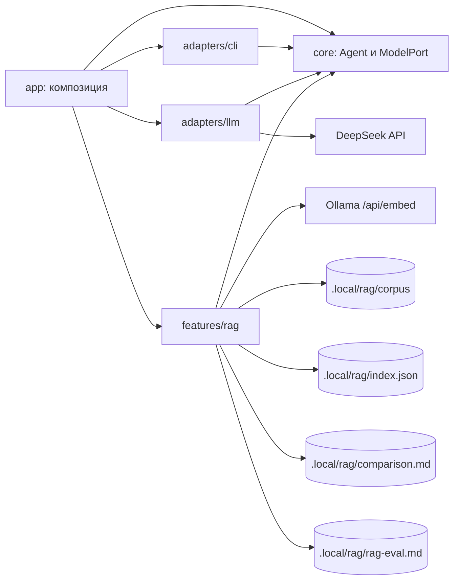

# Архитектура

## Текущее приложение

Исполняемый workspace `apps/host`. Общих библиотек и серверов нет. `app/main.ts` принимает окружение, argv и потоки;
`app/compose.ts` собирает приложение. Модель DeepSeek создаётся лениво при первом `ask`, `rag ask` или `rag eval`, поэтому
справка, настройки, `rag index` и `rag compare` работают без ключа.

Agent инкапсулирует ModelPort и текст системной инструкции; между вызовами `respond()` история не накапливается.
DeepSeekModel переводит формат SDK и ошибки в AgentError, SDK-повторы отключены. В ядре нет SDK, файлов, env,
CLI-команд и пользовательских подсказок. `ask` по умолчанию отправляет реплику модели без поиска по документам;
после `/rag on` тот же ввод отвечает с RAG (раздел ниже).

CLI получает реестр обработчиков и потоки, не создаёт агента и не знает SDK. Вывод оформляет один CliView:
обработчики передают ему готовые строки итога, а цвет решает `styleText` отдельно для stdout и stderr. Ход длинной
операции (`rag index`) идёт в stderr и не смешивается с итогом. Текст из REPL становится вызовом ask; `/команда` и
подкоманда CLI используют один dispatch.

## Фича rag

`indexCorpus` выполняет шаги последовательно и заменяет индекс только после успеха всех запросов:

1. `loadCorpus` читает `.md` в стабильном порядке, нормализует текст, отделяет frontmatter и разбирает блоки mdast.
2. `describeModel` и прогрев одним текстом дают digest, размерность и `load_duration`.
3. Для каждой стратегии `buildChunks` режет документы, `embedAll` получает эмбеддинги пакетами по 8 текстов и
   проверяет ответ: число векторов, единую ненулевую размерность, конечность значений.
4. `writeIndex` пишет `index.json` через временный файл и `rename`.

`compareIndex` читает индекс, считает метрики (`metrics.ts`), выбирает три участка корпуса (`fragments.ts`) и пишет
`comparison.md` (`report.ts`); корпус на диске и модель ему не нужны. Формат индекса и ограничения — README фичи и ADR 0002.

`EmbeddingPort` принадлежит фиче: `ModelPort` описывает генерацию текста и для эмбеддингов не расширяется. Адаптер
Ollama лежит внутри фичи, потому что не нужен никому, кроме неё.

## Ответ с RAG

Режим сессии — локальная переменная `ragMode` в `run()` (`app/compose.ts`), общего mutable-контекста нет. `ask` и строка REPL
следуют режиму (старт — выключен), `rag ask` всегда отвечает с RAG, в CLI режим действует только на один запуск.
Оба режима берут один `app/system.md`; режим RAG добавляет `features/rag/prompts/answer.md` и фрагменты в сообщение
пользователя, поэтому единственное отличие режимов — найденный контекст.

`answerWithRag` (фича импортирует `Agent` и `AgentError` из публичного входа ядра, `features → core`):

1. `openIndex` читает `index.json` один раз и сверяет digest модели эмбеддингов с индексом (`INDEX_MODEL_MISMATCH`).
2. `EmbeddingPort.embed` получает один текст — вопрос; линейный перебор по косинусной близости даёт top-K чанков
   стратегии из `rag.chunkStrategy`.
3. `renderRagMessage` собирает Markdown: фрагменты с файлом, документом и разделами, затем вопрос.
4. `Agent(system.md + answer.md).respond(сообщение)` — история между вызовами не накапливается.

App создаёт новый `SearchIndex` на каждый `rag ask` (свежий индекс после `rag index` в той же сессии) и один на весь
`rag eval`. `rag eval` читает контрольные вопросы (`experiments/feod-rag/questions.md`), для каждого вызывает оба режима
последовательно и пишет `rag-eval.md`: найденные фрагменты, попадание ожидаемых файлов, ответы. Оценки качества в отчёт
не входят — их пишет автор в `experiments/feod-rag/README.md`. Решение — [ADR 0003](docs/adr/0003-first-rag-query.md).

## Границы и рост

Разрешённые импорты: app → core/adapters/features; adapters → core и публичные порты features; features → core.
Внешний вход фичи — index.ts. Фичи не импортируют друг друга даже через публичные входы.
Каждая фича содержит README, собственные тесты и, при необходимости, prompts/*.md.
Тесты внутри фичи могут обращаться к её внутренним файлам; тесты app — только к публичному входу.
При появлении нового процесса у него собственный composition root.

Сейчас в core есть ModelPort и ToolSource. ContextStep, TraceSink и контракты хранилищ заранее не объявляются:
когда задание потребует новый контракт, сначала принимается ADR с конкретным потребителем и проверяемой границей.
Не использовать общий mutable context или расширяемый объект с полями всех фич.
Правило записи: кандидат → save → замена. Временный файл и rename относятся к одному файлу.

## Настройки и документы

`app/settings.ts` — единственный реестр схем, defaults и признаков настроек; env и флаги вычисляются из ключей,
`app/settings.md` содержит описания. Порядок — default, YAML-файл, env, CLI; некорректный заданный источник
отклоняется, даже если перекрыт следующим. YAML использует плоские ключи с точками. Путь `config.file`
выбирается до чтения YAML. Справка и docs/configuration.md, docs/commands.md генерируются из реестров.
Перекрёстные ограничения (`rag.overlapChars` < `rag.chunkSizeChars`, `rag.minChunkChars` ≤ `rag.chunkSizeChars`)
проверяет `indexCorpus`, потому что реестр проверяет каждый ключ отдельно.

## Проверки

`npm run check`: Biome, TypeScript, dependency-cruiser (границы, циклы, публичные входы), размеры и структура,
актуальность генерируемых документов, тесты с coverage и сборка с запуском CLI из другого каталога.
Тесты без внешних API: fake ModelPort и EmbeddingPort, подменённый fetch, временные каталоги.
