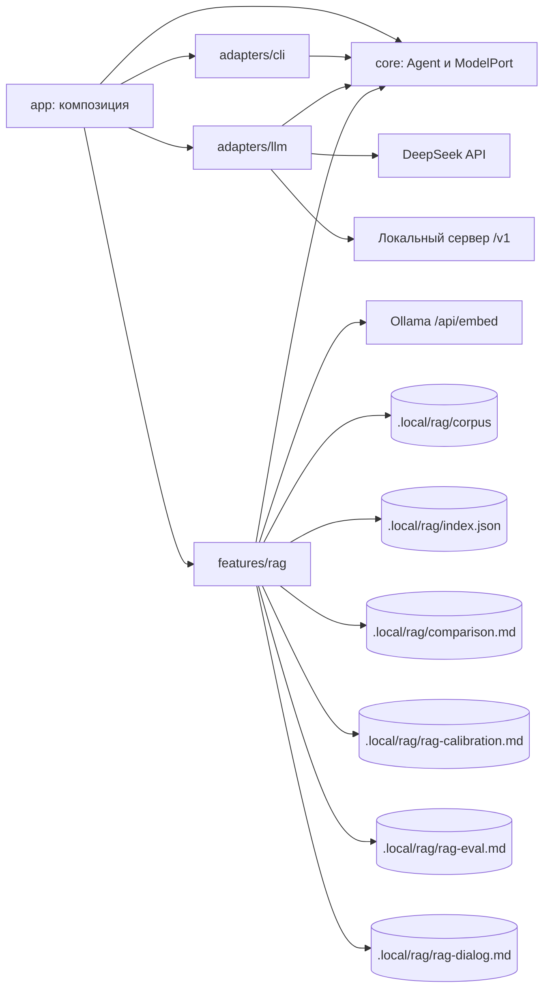

# Архитектура

## Текущее приложение

Исполняемый workspace `apps/host`. Общих библиотек и серверов нет. `app/main.ts` принимает окружение, argv и потоки;
`app/compose.ts` собирает приложение. Модель (DeepSeek или локальная по `llm.provider`) создаётся лениво при первом `ask`, `rag ask`, `rag eval`, `rag citations` или `rag dialog`, поэтому
справка, настройки, `rag index`, `rag compare` и `rag calibrate` работают без ключа.

Agent инкапсулирует ModelPort и текст системной инструкции и не хранит состояния: историю диалога передаёт вызывающий через
`respond(input, { history })`, а сообщения собираются как system → история → вопрос.
ChatCompletionsModel (DeepSeekModel и LocalModel отличаются адресом и полями тела запроса) переводит формат SDK и ошибки в AgentError, SDK-повторы отключены. В ядре нет SDK, файлов, env,
CLI-команд и пользовательских подсказок. `ask` по умолчанию отправляет реплику модели без поиска по документам;
после `/rag on` тот же ввод отвечает с RAG (раздел ниже).

CLI получает реестр обработчиков и потоки, не создаёт агента и не знает SDK. Вывод оформляет один CliView:
обработчики передают ему готовые строки итога, а цвет решает `styleText` отдельно для stdout и stderr. Ход длинной
операции (`rag index`) идёт в stderr и не смешивается с итогом. Текст из REPL становится вызовом ask; `/команда` и
подкоманда CLI используют один dispatch.

## Фича rag

`indexCorpus` выполняет шаги последовательно и заменяет индекс только после успеха всех запросов:

1. `loadCorpus` читает `.md` в стабильном порядке, нормализует текст, отделяет frontmatter и разбирает блоки mdast.
2. `describeModel` и прогрев одним текстом дают digest, размерность и `load_duration`.
3. Для каждой стратегии `buildChunks` режет документы, `embedAll` получает эмбеддинги пакетами по 8 текстов и
   проверяет ответ: число векторов, единую ненулевую размерность, конечность значений.
4. `writeIndex` пишет `index.json` через временный файл и `rename`.

`compareIndex` читает индекс, считает метрики (`metrics.ts`), выбирает три участка корпуса (`fragments.ts`) и пишет
`comparison.md` (`report.ts`); корпус на диске и модель ему не нужны. Формат индекса и ограничения — README фичи и ADR 0002.

`EmbeddingPort` принадлежит фиче: `ModelPort` описывает генерацию текста и для эмбеддингов не расширяется. Адаптер
Ollama лежит внутри фичи, потому что не нужен никому, кроме неё.

## Ответ с RAG

Режим сессии — локальная переменная `ragMode` в `run()` (`app/compose.ts`), общего mutable-контекста нет. `ask` и строка REPL
следуют режиму (старт — выключен), `rag ask` всегда отвечает с RAG, в CLI режим действует только на один запуск.
Оба режима берут один `app/system.md`; режим RAG добавляет `features/rag/prompts/answer.md` и фрагменты в сообщение
пользователя, поэтому единственное отличие режимов — найденный контекст.

`answerWithRag` (фича импортирует `Agent` и `AgentError` из публичного входа ядра, `features → core`) собирает независимые
операции:

1. `openIndex` читает `index.json` один раз и сверяет digest модели эмбеддингов с индексом (`INDEX_MODEL_MISMATCH`).
   `SearchIndex.search` остаётся низкоуровневым: эмбеддинг одного текста и линейный перебор по косинусной близости.
2. Rewrite (режимы `rewrite`, `rewrite-filter`): один вызов `Agent` с `prompts/rewrite.md` даёт одну строку запроса.
   Поиск возвращает `rag.candidateTopK` кандидатов стратегии `rag.chunkStrategy` по этой строке или по исходному вопросу.
3. Отбор — чистая функция над готовым списком: при фильтре `score >= rag.similarityThreshold`, затем первые `rag.topK`.
   Порядок и score не меняются, это не реранкинг.
4. Генерация по готовому отбору: при пустых hits модель не вызывается, код возвращает «не знаю» с просьбой уточнить вопрос.
   Иначе `renderRagMessage` собирает Markdown с фрагментами и **исходным** вопросом,
   `Agent(system.md + answer.md).respond(сообщение)` — одиночный вопрос, без истории. Ответ разбирается в
   `CitedAnswer`: `[N]` раскрывается в чанк по `rank`, каждая цитата проверяется на дословность, нарушения контракта
   возвращаются списком замечаний, а не исключением.

Параметры (`candidateTopK`, `topK`, порог) проверяет одна функция `checkRetrievalParams` до любых внешних вызовов.
`rag calibrate` использует только поиск и `EmbeddingPort`: один поиск на вопрос, четыре порога на общих кандидатах.
`rag eval` не вызывает `answerWithRag` четыре раза: на вопрос — исходный поиск (baseline, filter), один rewrite и один
поиск переписанной строки (rewrite, rewrite-filter), до четырёх генераций на общих кандидатах (при пустом отборе генерации
нет). `rag citations` вызывает `answerWithRag` на каждый вопрос в настроенном режиме. Отчёты `rag-calibration.md`,
`rag-eval.md` и `rag-citations.md` пишутся один раз после успеха.

App создаёт новый `SearchIndex` на каждый `rag ask` (свежий индекс после `rag index` в той же сессии) и один на весь
`rag eval`, `rag citations` и `rag calibrate`. Контрольные вопросы — `experiments/feod-retrieval/questions.md`; оценки качества в отчёты не
входят, их пишет автор в README эксперимента. Решения — [ADR 0003](docs/adr/0003-first-rag-query.md),
[ADR 0004](docs/adr/0004-relevance-filter-and-query-rewrite.md) и [ADR 0005](docs/adr/0005-citations-and-refusal.md).

## Чат с RAG

Режим `/rag on` превращает реплики REPL в чат: `ask` и обычная строка вызывают `chatTurn` (`features/rag/chat/`), `rag ask`
остаётся одиночным. Источник истины — локальная переменная `dialog` в `run()` (`app/compose.ts`) рядом с `ragMode`: неизменяемый
`Dialog` с памятью задачи и ходами. `app/ragChat.ts` вызывает `chatTurn`, а `compose.ts` присваивает возвращённый диалог только
после успешного хода; ошибка оставляет прежний. Файлов сессий нет, диалог живёт до выхода из REPL; `/rag off` его не сбрасывает,
`/rag reset` сбрасывает. `chatTurn` не хранит состояния и выполняет шаги в фиксированном порядке:

1. Проверка параметров поиска и `rag.historyTurns`; пустой вопрос — `AgentError EMPTY_INPUT`.
2. Обновление памяти задачи: `Agent` с `prompts/task-state.md` получает текущую память и новое сообщение (ответов ассистента
   не видит), а возвращает Markdown-разделы `Цель`, `Уточнения`, `Ограничения и термины`. Ответ без непустой «Цели» не разобран — память прежняя.
3. Rewrite (режимы `rewrite`, `rewrite-filter`) с `prompts/rewrite-chat.md`: память и две последние реплики раскрывают отсылки
   вопроса; пункты памяти, на которые вопрос не ссылается, в запрос не добавляются.
4. `index.search` и `selectForMode` — те же, что в `answerWithRag`.
5. `generateAnswer`: system = `system.md` + `answer.md` + `chat.md`, затем последние `rag.historyTurns` ходов отдельными
   `user`/`assistant`-сообщениями, затем сообщение с разделами «Память задачи», «Фрагменты документации», «Вопрос». При пустом
   отборе модель не вызывается, память к этому моменту уже обновлена.

В историю ответ идёт в формате ответа модели (`## Ответ`, `## Источники`, `## Цитаты` или `## Не знаю`, `## Уточнение`); строка
источника дополнена файлом и разделом, потому что `[N]` относится к фрагментам своего хода. На ход приходится до трёх вызовов модели. `rag dialog` прогоняет сценарии `rag.dialogFile`, каждый в новом
пустом `Dialog`, и пишет `rag-dialog.md` один раз после успеха: сводка (источники, цитаты, «не знаю», сохранение цели и ключей
памяти), таблица ходов, фрагменты, ответ и память после каждого хода. Решение — [ADR 0006](docs/adr/0006-rag-chat-memory.md).

## Границы и рост

Разрешённые импорты: app → core/adapters/features; adapters → core и публичные порты features; features → core.
Внешний вход фичи — index.ts. Фичи не импортируют друг друга даже через публичные входы.
Каждая фича содержит README, собственные тесты и, при необходимости, prompts/*.md.
Тесты внутри фичи могут обращаться к её внутренним файлам; тесты app — только к публичному входу.
При появлении нового процесса у него собственный composition root.

Сейчас в core есть ModelPort и ToolSource. ContextStep, TraceSink и контракты хранилищ заранее не объявляются:
когда задание потребует новый контракт, сначала принимается ADR с конкретным потребителем и проверяемой границей.
Не использовать общий mutable context или расширяемый объект с полями всех фич.
Правило записи: кандидат → save → замена. Временный файл и rename относятся к одному файлу.

## Настройки и документы

`app/settings.ts` — единственный реестр схем, defaults и признаков настроек; env и флаги вычисляются из ключей,
`app/settings.md` содержит описания. Порядок — default, YAML-файл, env, CLI; некорректный заданный источник
отклоняется, даже если перекрыт следующим. YAML использует плоские ключи с точками. Путь `config.file`
выбирается до чтения YAML. Справка и docs/configuration.md, docs/commands.md генерируются из реестров.
Перекрёстные ограничения (`rag.overlapChars` < `rag.chunkSizeChars`, `rag.minChunkChars` ≤ `rag.chunkSizeChars`)
проверяет `indexCorpus`, а `rag.topK` ≤ `rag.candidateTopK` — `checkRetrievalParams`, потому что реестр проверяет каждый ключ отдельно.

## Проверки

`npm run check`: Biome, TypeScript, dependency-cruiser (границы, циклы, публичные входы), размеры и структура,
актуальность генерируемых документов, тесты с coverage и сборка с запуском CLI из другого каталога.
Тесты без внешних API: fake ModelPort и EmbeddingPort, подменённый fetch, временные каталоги.
